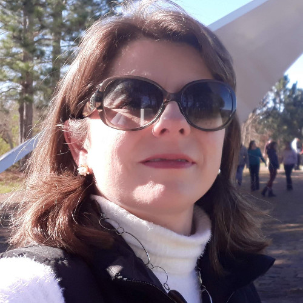
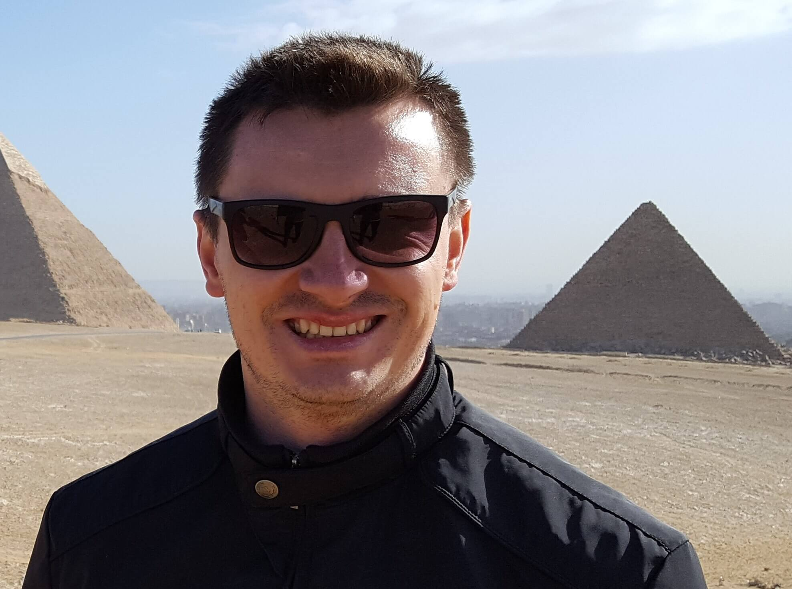
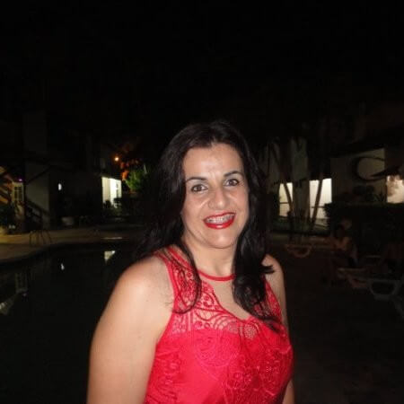

# Quadro Docente Técnico

## Angelita Rettore de Araujo Zanella

**:mortar_board: Graduação**: Bacharelado em Ciências da Computação 
**:closed_book: Última Formação**: Mestrado em Informática  
**:e-mail: E-mail**: angelita.zanella@ifc.edu.br  
**:books: Áreas de pesquisa**: Internet das Coisas e Segurança e Agricultura Inteligente  
**:pushpin: Disciplinas que ministra**: <a href="disciplinas.md/#ledger-redes-locais">Redes Locais (PPC antigo)</a> e <a href="disciplinas.md/#ledger-redes">Redes (PPC antigo)</a> 

  

## Diego Ricardo Krohl

**:mortar_board: Graduação**: Doutorado em Educação Científica e Tecnológica 
**:closed_book: Última Formação**: Mestrado em Engenharia de Processos  
**:e-mail: E-mail**: diego.krohl@ifc.edu.br  
**:books: Áreas de pesquisa**: Inovação Tecnológica, Inteligência Computacional Aplicada e Programação  
**:pushpin: Disciplinas que ministra**: <a href="disciplinas.md/#ledger-programação-i">Programação I (PPC antigo)</a>  

  

## Fabiana Mara Rubini

**:mortar_board: Graduação**: Sistemas de Informação  
**:closed_book: Última Formação**: Especialização em Desenvolvimento Web  
**:e-mail: E-mail**: fabiana.rubini@ifc.edu.br  
**:books: Áreas de pesquisa**: Gestão Escolar e Tecnologia Educacional  
**:pushpin: Disciplinas que ministra**: <a href="disciplinas.md/#hardware">Hardware</a>, <a href="disciplinas.md/#ledger-engenharia-de-software-i">Engenharia de Software I (PPC antigo)</a> e <a href="disciplinas.md/#ledger-hardware">Hardware (PPC antigo)</a>  

   

## Fábio José Rodrigues Pinheiro

**:mortar_board: Graduação**: Ciências da Computação 
**:closed_book: Última Formação**: Mestrado em Engenharia Elétrica 
**:e-mail: E-mail**: fabio.pinheiro@ifc.edu.br 
**:books: Áreas de pesquisa**: Desenvolvimento de Sistemas, Sistemas Distribuídos e Web Services  
**:pushpin: Disciplinas que ministra**: <a href="disciplinas.md/#ledger-programação-ii">Programação II (PPC antigo)</a>  

      

## Kennedy Ferreira Araújo

**:mortar_board: Graduação**: Sistemas de Informação  
**:closed_book: Última Formação**: Mestrado Profissional em Gestão e Tecnologia Industrial  
**:e-mail: E-mail**: kennedy.araujo@ifc.edu.br 
**:books: Áreas de pesquisa**: Aplicativos Híbridos, Aplicações Web e Experiência do Usuário  
**:pushpin: Disciplinas que ministra**: <a href="disciplinas.md/#ledger-engenharia-de-software-ii">Engenharia de Software II (PPC antigo)</a>

      

## Leila Lisiane Rossi

**:mortar_board: Graduação**: Bacharelado em Ciências da Computação  
**:closed_book: Última Formação**: Mestrado em Ciências da Computação  
**:e-mail: E-mail**: leila.rossi@ifc.edu.br  
**:books: Áreas de pesquisa**: Banco de Dados, Computação Musical e Engenharia de Software  
**:pushpin: Disciplinas que ministra**: <a href="disciplinas.md/#ledger-banco-de-dados-i">Banco de Dados I (PPC antigo)</a> e <a href="disciplinas.md/#ledger-banco-de-dados-ii">Banco de Dados II (PPC antigo)</a>  

   

## Manassés Ribeiro

**:mortar_board: Graduação**: Sistemas de Informação  
**:closed_book: Última Formação**: Doutorado em Engenharia Elétrica e Informática Industrial  
**:e-mail: E-mail**: manasses.ribeiro@ifc.edu.br  
**:books: Áreas de pesquisa**: Autoencoders, Deep Learning e Redes Neurais  
**:pushpin: Disciplinas que ministra**: <a href="disciplinas.md/#ledger-tópicos-especiais-integrados">Tópicos Especiais Integrados (PPC antigo)</a> 

      

## Maurício Natanael Ferreira

**:mortar_board: Graduação**: Bacharelado em Sistemas de Informação  
**:closed_book: Última Formação**: Especialização em Desenvolvimento Web  
**:e-mail: E-mail**: mauricio.ferreira@ifc.edu.br  
**:books: Áreas de pesquisa**: Desenvolvimento de Softwares e Programação.  
**:pushpin: Disciplinas que ministra**: <a href="disciplinas.md/#multimídia">Multimídia</a> e <a href="disciplinas.md/#web-design">Web Design</a>  

      

## Nadir Paula da Rosa

**:mortar_board: Graduação**: Administração com Habilitação em Comércio Exterior  
**:closed_book: Última Formação**: Especialização em Educação Profissional Tecnológica  
**:e-mail: E-mail**: nadir.rosa@ifc.edu.br  
**:books: Áreas de pesquisa**: Agricultura Familiar, Desenvolvimento Rural, Estratégias Competitivas e Tomadas de Decisão 
**:pushpin: Disciplinas que ministra**: <a href="disciplinas.md/#ledger-administração-e-empreendedorismo">Administração e Empreendedorismo (PPC antigo)</a>  

   

## Rosa Maria Pascoali

**:mortar_board: Graduação**: Mestrado em Ciências da Computação  
**:closed_book: Última Formação**: Doutorado em Ciências da Educação  
**:e-mail: E-mail**: rosa.pascoali@ifc.edu.br  
**:books: Áreas de pesquisa**: Ciências Contábeis, Sistemas de Informações,  Tecnologia em Negócios Imobiliários e Tecnologia em Processos Gerenciais 
**:pushpin: Disciplinas que ministra**: <a href="disciplinas.md/#ledger-redes-locais">Redes Locais (PPC antigo)</a> e <a href="disciplinas.md/#ledger-redes">Redes (PPC antigo)</a> 

   

## Rosangela Aguiar Adam

**:mortar_board: Graduação**: Mestrado em Ciências da Computação  
**:closed_book: Última Formação**: Especialização em Computação  
**:e-mail: E-mail**: rosangela.adam@ifc.edu.br  
**:books: Áreas de pesquisa**: Acessibilidade do Conteúdo Digital para a Educação e Robótica  
**:pushpin: Disciplinas que ministra**: <a href="disciplinas.md/#fundamentos-de-informática">Fundamentos de Informática</a>  

## Wagner Carlos Mariani

**:mortar_board: Graduação**: Ciência da Computação  
**:closed_book: Última Formação**: Mestrado em Informática  
**:e-mail: E-mail**: wagner.mariani@ifc.edu.br  
**:books: Áreas de pesquisa**: Automação Industrial, Computação Gráfica, Redes e Arquitetura de Computadores  
**:pushpin: Disciplinas que ministra**: <a href="disciplinas.md/#hardware-e-sistemas-operacionais">Sistemas Operacionais</a> e <a href="disciplinas.md/#ledger-hardware-e-sistemas-operacionais">Sistemas Operacionais (PPC antigo)</a> 

   

## Wanderson Rigo

**:mortar_board: Graduação**: Mestrado em Ciências da Computação  
**:closed_book: Última Formação**: Mestrado em Ciências da Computação  
**:e-mail: E-mail**: wanderson.rigo@ifc.edu.br  
**:books: Áreas de pesquisa**: Tecnologias para Desenvolvimento de Sistemas Web, Inteligência Computacional e  Robótica para Educação 
**:pushpin: Disciplinas que ministra**: <a href="disciplinas.md/#lógica-de-programação">Lógica de Programação</a>  

   
