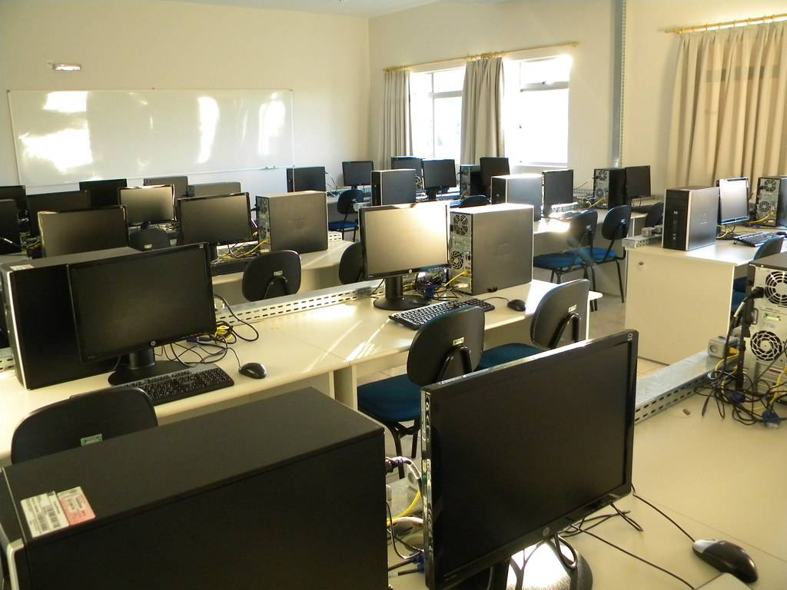

# Sobre o curso

### Navegação 
<ul>
    <li>
        <a href="#sobre-o-curso"> Sobre o curso</a>
    </li>
    <ul>
        <li>
            <a href="#possibilidades-de-atuação"> Possibilidades de atuação</a>
        </li>
        <li>
            <a href="#forma-de-ingresso"> Forma de ingresso</a>
        </li>
    </ul>
</ul>

## Sobre o curso

O **Curso Técnico em Informática** do Instituto Federal Catarinense – Campus Videira – forma profissionais para atuar em atividades de concepção, especificação, implementação, avaliação, suporte e manutenção de sistemas, de computadores e de tecnologias de processamento e transmissão de dados e informações.

Além da formação técnica, o curso proporciona o desenvolvimento de habilidades como iniciativa, persistência, compromisso, liderança, cooperação e relacionamento interpessoal. Os profissionais formados neste curso estão aptos ao exercício de suas funções, são conscientes de suas responsabilidades e possuem visão crítica que lhes permite colaborar com os setores industriais e comerciais, visando o progresso da região. São capazes de participar ativamente das mudanças da realidade nacional vigente, não apenas no contexto empresarial, mas também no contexto social, político e econômico em que ela se insere.

A carga horária total contempla práticas profissionais, que deverá ser cumprida pelo estudante para obter o certificado de conclusão do curso. As práticas profissionais poderão ser cumpridas durante ou após o período de formação, devendo ser concluídas em um prazo máximo de dois semestre após a conclusão das disciplinas.

---

**Quantidade de vagas** 
 70 vagas totais, sendo duas turmas de 35 alunos.

**Modalidade** 
 Integrado ao Ensino Médio, onde além da formação técnica o aluno cursa as disciplinas normais do ensino médio, como Português, Matemática, Física, Química, Biologia entre outras.

**Carga horária** 
 3730 horas totais, sendo 1200 horas do Ensino Técnico Profissionalizante (incluído 130 horas de estágio curricular e práticas profissionais que podem ser cumpridas em qualquer momento durante o curso) e 2400 horas de Ensino Básico.

**Período** 
 Integral (matutino e vespertino).

**Pré-requisitos** 
 Ensino Fundamental Completo e demais informações previstas no Edital.

---

### Possibilidades de atuação

   Instituições públicas, privadas e do terceiro setor que demandem sistemas computacionais, especialmente envolvendo programação e manutenção de computadores.

### Forma de ingresso

O ingresso é realizado a partir de um **exame de classificação** ofertado de acordo com o calendário acadêmico da instituição. 

Para se inscrever, acesse o [Portal de Ingresso](https://ingresso.ifc.edu.br/) do IFC. 

---

